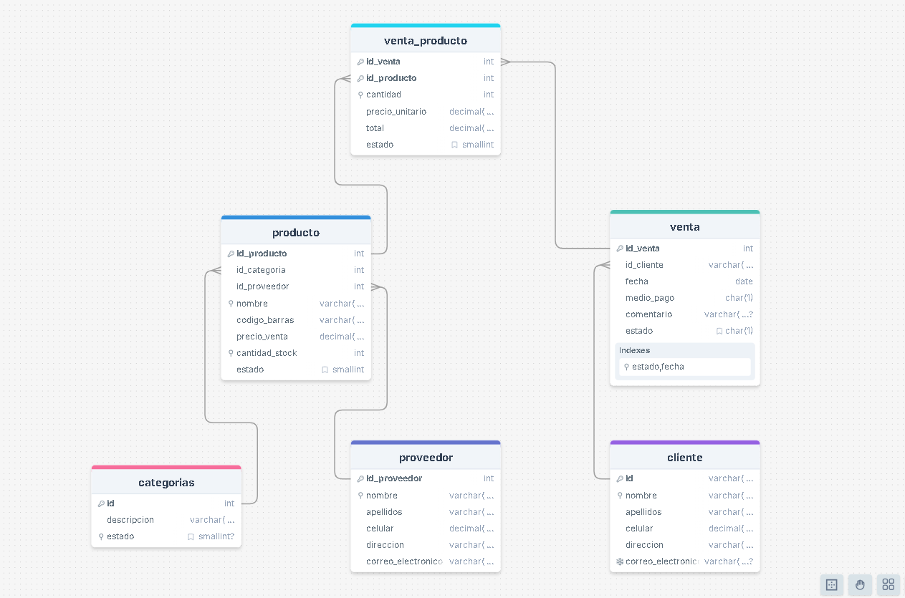

# 🏪 TechZone

## Repositorio de notas
https://github.com/Darwin-max/postgresql_inicializacion.git

## Proyecto
La tienda **TechZone** es un negocio dedicado a la venta de productos tecnológicos, desde laptops y teléfonos hasta accesorios y componentes electrónicos. Con el crecimiento del comercio digital y la alta demanda de dispositivos electrónicos, la empresa ha notado la necesidad de mejorar la gestión de su inventario y ventas. 

## Funcionalidad
​	1️⃣ **Registro de Productos:** Cada producto debe incluir su nombre, categoría, precio, stock disponible y proveedor. - relacion con **proveedor**

​	2️⃣ **Registro de Clientes:** Se debe almacenar la información de cada cliente, incluyendo nombre, correo electrónico y número de teléfono. - **no** relacion

​	3️⃣ **Registro de Ventas:** Cada venta debe incluir qué productos fueron vendidos, en qué cantidad y a qué cliente. - relacion con **cliente**

​	4️⃣ **Registro de Proveedores:** La tienda obtiene productos de diferentes proveedores, por lo que es necesario almacenar información sobre cada uno.

​	5️⃣ **Consultas avanzadas:** Se requiere la capacidad de analizar datos clave como productos más vendidos, ingresos por proveedor y clientes más frecuentes.

​	6️⃣ **Procedimiento almacenado con transacciones:** Para asegurar que no se vendan productos sin stock, el sistema debe validar la disponibilidad de inventario antes de completar una venta.

## Modelo E-R



## Descripcion de cada Script

- 📌 modelo_er.png → Imagen del modelo Entidad-Relación.

- 📌 db.sql → Script de creación de la base de datos y tablas.

- 📌 insert.sql → Script para insertar datos de prueba en la base de datos.

- 📌 queries.sql → Conjunto de consultas avanzadas para análisis de datos.

- 📌 procedure.sql → Procedimiento almacenado para gestionar ventas con transacciones.

## PostgreSQL con Docker

### Creacion del Contenedor
```bash
docker run -d --name postgres_container -e POSTGRES_USER=admin -e POSTGRES_PASSWORD=admin -e POSTGRES_DB=techzone -p 5433:5432 -v pgdata:/var/lib/postgresql/data --restart=unless-stopped postgres:15
```

### Conectar al contenedor de docker
```bash
docker exec -it postgres_container bash
```

### Conectar con PostgreSQL bajo Consola
```bash
psql --host=localhost --username=admin -d techzone --password

psql -h localhost -U admin -d techzone -W
```

## Ejecutar consultas y procedimientos almacenados
Aqui encontraras dichos archivos
- 📌 queries.sql → Conjunto de consultas avanzadas para análisis de datos.

- 📌 procedure.sql → Procedimiento almacenado para gestionar ventas con transacciones.


PostgreSQL con Docker
Creación del Contenedor 🙏🏻
docker run -d --name postgres_container -e POSTGRES_USER=admin -e POSTGRES_PASSWORD=admin -e POSTGRES_DB=campus -p 5433:5432 -v pgdata:/var/lib/postgresql/data --restart=unless-stopped postgres:15
Conectar al Contenedor de Docker
docker exec -it postgres_container bash
Conectar con PostgreSQL bajo Consola
psql --host=localhost --username=admin -d campus --password


psql -h localhost -U admin -d campus -W


Comandos PSQL
\l : Lista las bases de datos
\c {db_name}: Cambiar a una base de datos existente

